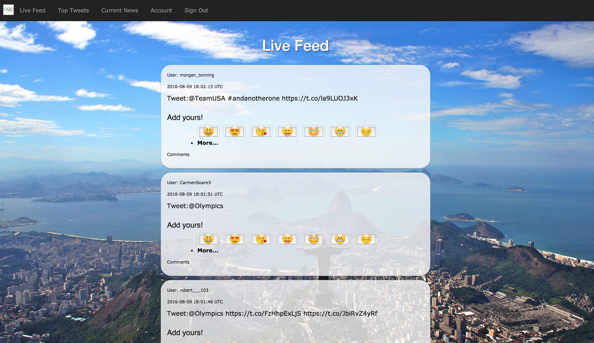

# README Rio-De-Emoji

Rio-De_emoji is a twitter platform interface built in Rails 5.
It uses a simple eventmachine/twitterstream gem combination to
provide users with a stream of incoming tweets based on the top 10 active US Olympic Twitter Accounts.
Users are able to interact with these tweets by "upvoting them" with a selection of Emojis.
They are also able to comment on the tweets should they feel the emoji library is limiting.
All the dependencies can be found in the gem file and a few specific ones will be discussed below.

## Technologies Used
Rails Version ~ Rails 5.0.

The main engine behind the app are two gems that are [available](rubygems.org) at rubygems.org. Their github repositories are listed below:
* [Ruby on Rails](https://github.com/rails/rails) ~ Rails 5.0.
* [TweetStream](https://github.com/tweetstream/tweetstream): Connect and receive live tweets  ~ 2.6.0
* [Event Machine](https://github.com/eventmachine/eventmachine): set up tasks in combined gems ~ v1.2.0.1
* [Devise](https://github.com/plataformatec/devise): user authentication and storage
* [Heroku](http://www.heroku.com/): hosting this bad boy

## Technologies: TweetStream & Event Machine
These two gems allow us to open a low latency https connection with the Twitter public streaming API.

After authenticating with TweetStream, the gem provides us the option to filter and follow accounts using a few different methods native to the Twitter API.

These methods are based on the underlying EventMachine gem and allow us to build a structure that combines active record validators and TweetStream methods.

After selecting and establishing the the stream from the aforementioned accounts we're able to use active records regular expression validator to parse out and save tweets from our stream to the required database. For more clarity on this process and to see the code used for this please see lib/tasks/twitter.rake

Speaking of rake files ... the functionality of just creating and eventmachine isn't completely practical when you can't access the process to actually scrape the tweets and keep them updating live.

To solve this I've built a rake script that can run in the background while development is happening as well as on any computer I choose to host the DB when the site is deployed.

##App approach
Before writing any code I made sure to lay out my tables and relationships as best I could.
I started with a very basic table model we had covered in class:

* User table
* Comments table

I then added tables for Tweets and Emojis since I knew that those were data types I wanted to have access to within the app.

Finally, I was able to create a join table that linked the 3 most relevant datatypes together to represent a place where an emoji was stored next to a tweet based on a user's input. This is the emojotweet table.

At its very core I wanted this app to be a simple stream, vote, and re-examine platform. User's view the stream, vote on their preferences with emojis, and then can examine other tweets that other users have also voted on.

###Installation Instructions
This one is going to be hard to install since you need to twitter api secret key that is bound to my account. You cna fork and update the project, but need to populate the rake file with your own keys to get it working.

 If you want to hangout and play on the app the heroku hosted domain is listed above next to the repositories name. A demo of the app can be found below!

## Screencast and Demo

###Unsolved Problems
* There are a few styling problems I want to solve such as making an emoji animation, the actual presentation of the numbers, and the tweet boxes themselves.
* I also want to make a user interactive side of the application where users can friend, talk to, and share threads that they find funny on the page.

These things and more will hopefully be added on as I continue to hack away at this project!
